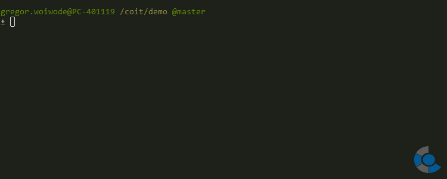

# git-prefix

## Commits via convention
`git_prefix` enhances `git checkout`. When a branch has changed `git_prefix` will check if it matches the pattern `feature/<any>`. `<any>` is taken as prefix for all commits that will be created on the branch `feature/<any>`.

*Note* that the automatic prefix is configured for branches that start with `feature/`.

The prefix is saved in the environment variable `GIT_COMMIT_PREFIX`. It will be read by the `prepare-commit-msg` hook to set the prefix in front of each commit message.

| Usage                    | Explanation                     |
|--------------------------|---------------------------------|
| `git_prefix <branch>`    | Use prefix in a existing branch |
| `git_prefix -b <branch>` | Create and prefix a new branch  |
